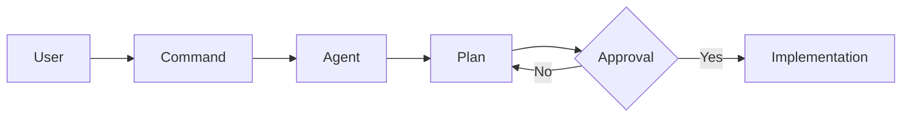

# Agentic AI Framework
**Standardized orchestration for specialized AI Agents.**

## Overview
This repository defines a framework of autonomous AI Agents (Engineer, Compliance, Researcher) designed to collaborate on complex tasks using the **Agentic Modular Design (AMD)** architecture. Each agent is a self-contained module of persona, skills, commands, and knowledge.

## Quick Documentation Links
- [Business Flow](./docs/BUSINESS_FLOW.md) – Value proposition and use cases.
- [Technical Specifications](./docs/TECHNICAL_SPECS.md) – Entry points, logic flows, and architecture.
- [AI Context](./docs/AI_Context.md) – Architectural design, patterns, and conventions.

## Core Agents
- **[Engineer](./engineer/)**: Specialized in software design, implementation, and review.
- **[Compliance](./compliance/)**: Focused on regulatory audits (GDPR, HIPAA, SOC2, etc.).
- **[Researcher](./researcher/)**: Information gathering and synthesis.

## How It Works
Agents are triggered via TOML-based commands in the Gemini CLI. They follow strict execution protocols with human-in-the-loop approval gates to ensure safety and correctness.

