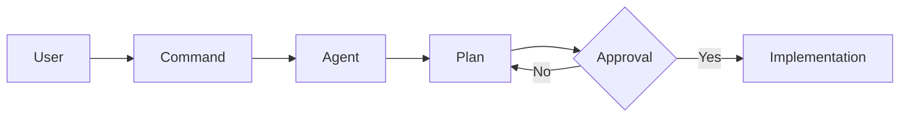

# Agentic AI Framework
**Standardized orchestration for specialized AI Agents.**

## Overview
This repository defines a framework of autonomous AI Agents (**Architect, Backend, Frontend, Mobile**, Compliance, Researcher) designed to collaborate on complex tasks using the **Agentic Modular Design (AMD)** architecture. Each agent is a self-contained module of persona, skills, commands, and knowledge, specialized for a specific domain.

## Core Features
- **Specialized Engineering Suite:** Dedicated agents for systems architecture, server-side logic, web UI (React/Vue/Angular), and mobile (Flutter/Dart).
- **Namespaced Command Structure:** Clear, standardized triggers (e.g., `/architect:create`, `/mobile:discovery`).
- **High-End Architectural Knowledge:** Embedded expertise in SOLID, Clean Architecture, Resilience Patterns, and Web Vitals.
- **MCP Integration:** Native support for the Model Context Protocol (Stitch, Context7, Dart/Flutter, DevTools, Playwright) to enhance codebase analysis and auditing.
- **Human-in-the-Loop Safety:** Strict execution protocols with mandatory approval gates for research, planning, and implementation.

## Quick Documentation Links
- [Business Flow](./docs/BUSINESS_FLOW.md) – Value proposition and use cases.
- [Technical Specifications](./docs/TECHNICAL_SPECS.md) – Entry points, logic flows, and architecture.
- [AI Context](./docs/AI_Context.md) – Architectural design, patterns, and conventions.

## Core Agents
- **[Architect](./architect/)**: Specialized in systems design, implementation, and review.
- **[Backend](./backend/)**: Specialized in software implementation and server-side logic.
- **[Frontend](./frontend/)**: Specialized in UI/UX architecture, Vue, Angular, and React.
- **[Mobile](./mobile/)**: Specialized in cross-platform mobile apps using Dart and Flutter.
- **[Compliance](./compliance/)**: Focused on regulatory audits (GDPR, HIPAA, SOC2, etc.).
- **[Researcher](./researcher/)**: Information gathering and synthesis.
- **[n8n Specialist](./n8n/)**: Architecting, implementing, and optimizing complex automation workflows.

## How It Works
Agents are triggered via TOML-based commands in the Gemini CLI. They follow strict execution protocols with human-in-the-loop approval gates to ensure safety and correctness.

