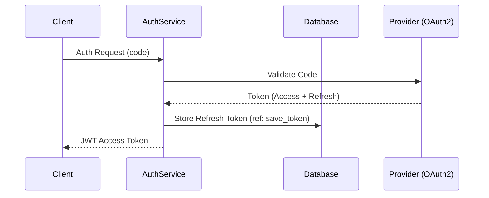

# Technical Specifications
**Grounding:** Strictly extracted from AST/Codebase. 
**Verification:** (ref: Source Citation Required)

## 1. Entry Points & Access Control
| Type | Endpoint/Trigger | Description | Allowed Roles | Security/Auth |
| :--- | :--- | :--- | :--- | :--- |
| [POST] | `/v1/resource` | Primary action summary | `Admin`, `User` | `JWT (Scopes: x)` |

## 2. Dependency Rules & Lifecycle
- **Internal Dependencies:** [e.g., `UserRepository` injected as Singleton via `Punq`]
- **External Dependencies:** [e.g., `Stripe SDK` wrapped in `PaymentGatewayAdapter`]
- **Inversion of Control:** [How the code handles the 'New' keyword: Dependency Injection vs. Factory]

## 3. Data & Persistence Standards
### Database: [SQL Server | Postgres | MongoDB]
- **Affected Tables/Collections:** [List of tables modified by this module]
- **Write Strategy:** [e.g., Unit of Work, Atomic Transaction, or Eventual Consistency]
- **Indexes Used:** - [Index Name]: [Fields] (Used by: `find_user_by_email`)
    - [Index Name]: [Fields] (Used by: `search_orders_by_date`)

## 4. Resilience & Reliability
### Retry Policies
- **Entry Point Retries:** [e.g., "None (Client-side responsibility)"]
- **External Call Retries:** - **Service A:** [e.g., "Exponential Backoff (3 attempts, max 10s jitter)"] (ref: `resilience_config.py`)
    - **Database Retries:** [e.g., "Retry on Deadlock (Max 2 retries)"]

## 5. Logic Deep Dive (Sequential)
### [Step Name]
1. **Trigger:** [How it starts]
2. **Validations:** [if/else rules] (ref: `function_name`)
3. **Execution:** [State changes/IO]
4. **Side Effects:** [Events published to Message Broker / Cache Invalidation]

### 5.X Technical Flow Visualization
> **Condition:** Required for processes with >3 state changes, Auth flows, or complex math logic.

## 6. Complexity Analysis (Dialectical)
- **Yellow Hat (Robustness):** [Where the flow is secure/atomic]
- **Black Hat (Risks):** [Tight coupling, blocking IO, single points of failure]
- **Blind Spots:** [What the code ignores: e.g., "No handling for partial S3 uploads"]