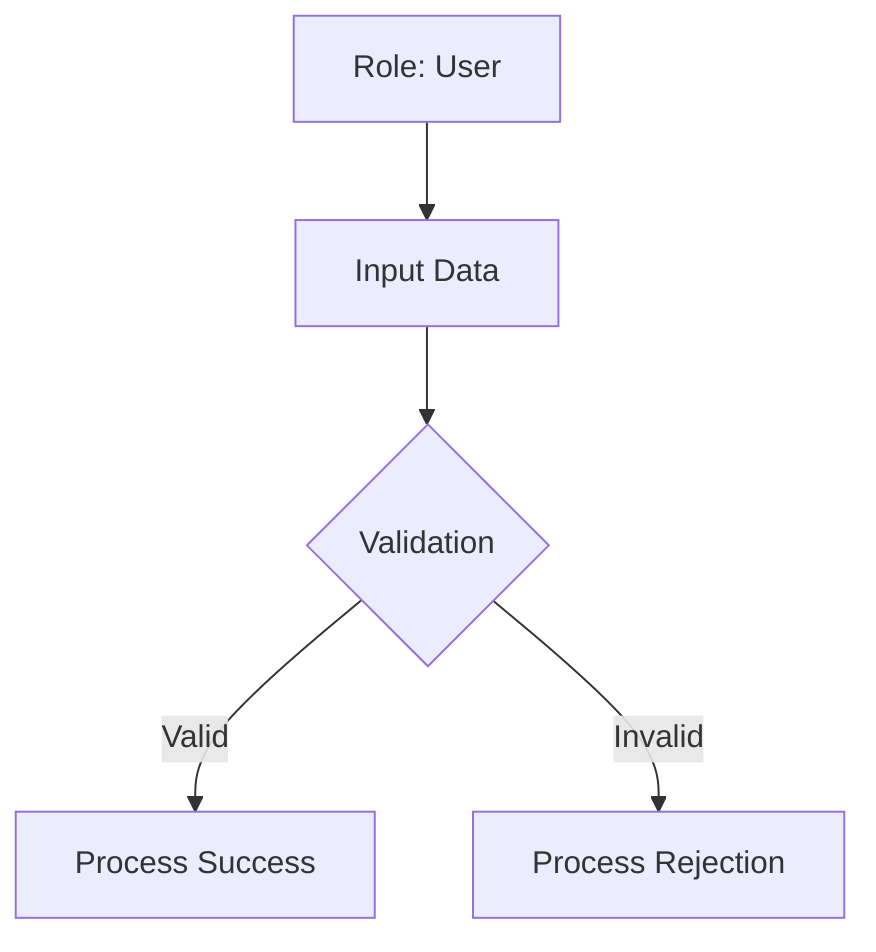

# Use Case: [Name]
**Status:** [STATE] | **Last AST Sync:** [Date]

## 1. Description
[A fluid, non-technical description of the journey from trigger to resolution.]

## 2. Details
- **Primary Role:** [e.g., Administrator, Anonymous User, Customer]
- **Success Criteria:** [What defines the completion of this business process?]

## 3. Visual Logic (Mermaid)

## 4. Key Business Rules
* **Rule 1**: [Business logic, e.g., "Only Managers can approve refunds over $500"]
* **Rule 2**: (ref: function_name)
