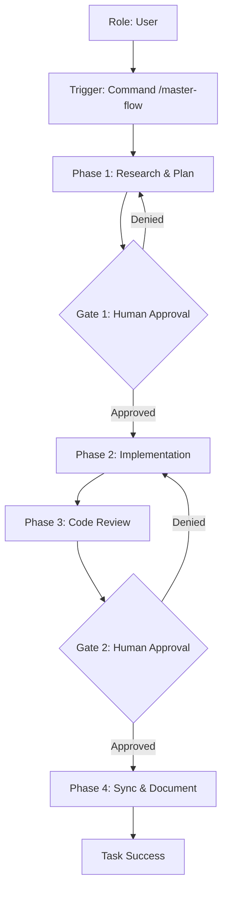

# Business Flow: Agentic AI Framework
**Status:** [GREENFIELD] | **Last AST Sync:** 2026-03-03

## 1. Value Proposition
A standardized framework for building and orchestrating specialized, autonomous AI Agents to solve complex engineering, research, and compliance tasks with high fidelity and human-in-the-loop safety.

## 2. Business Use Cases

### 2.1 Software Engineering Lifecycle
- **Description:** An autonomous workflow that moves from a business requirement to a validated, documented implementation through research, planning, execution, and review.
- **Primary Role:** Software Engineer / Systems Architect
- **Success Criteria:** 100% test pass rate, updated documentation, and a peer-reviewed implementation plan.

### 2.2 Regulatory & Compliance Audit
- **Description:** A specialized process to audit codebase changes or business processes against specific regulations like GDPR, HIPAA, or SOC2.
- **Primary Role:** Compliance Officer
- **Success Criteria:** A structured audit report identifying gaps and providing remediation steps.

### 2.3 Research & Information Synthesis
- **Description:** Gathering data and technical insights to inform decision-making or generate reports.
- **Primary Role:** Researcher
- **Success Criteria:** A comprehensive research report with synthesized findings.

### 2.4 Visual Logic (Mermaid)

## 3. Key Business Rules
* **Rule 1: Human-in-the-Loop:** No implementation or commit occurs without explicit user approval of the plan or the final review.
* **Rule 2: Zero Trust:** Unverified code is never merged. All changes must be backed by unit or integration tests.
* **Rule 3: Conceptual Integrity:** All code changes must be reflected in the documentation immediately after implementation.
