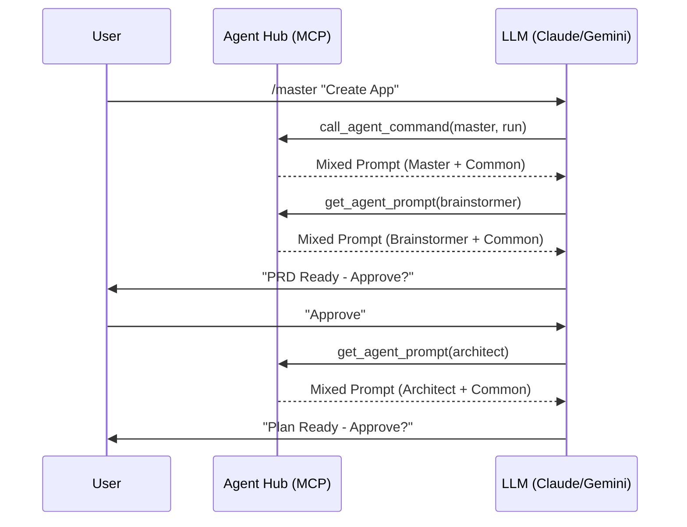

# Technical Specifications: Universal Agent Hub
**Grounding:** Strictly extracted from the `agent-hub` implementation and AMD v2 logic.
**Verification:** (ref: index.js, bin/agent-hub.js, common/knowledge)

## 1. Entry Points & Access Control
| Type | Endpoint / Tool | Description | Target |
| :--- | :--- | :--- | :--- |
| [CLI] | `agent-hub bootstrap` | One-time local environment setup. | Gemini / AntiGravity |
| [MCP] | `get_agent_prompt` | Retrieves mixed (Common + Specific) persona. | Claude / Gemini |
| [MCP] | `call_agent_command` | Resolves and executes TOML-based commands. | Claude / Gemini |
| [TOML]| `/master:run` | Triggers the Master Orchestrator PM loop. | Gemini CLI |
| [SYM] | `agent-hub link` | Symlinks central personas to local IDE configs. | Codex / Cursor |

## 2. Infrastructure: The Agent Hub
- **Runtime:** Node.js (ESM).
- **Core Package:** `@modelcontextprotocol/sdk`.
- **Logic mixing:** The Hub server dynamically scans `common/knowledge` and `common/skills` and appends them to every agent prompt returned via MCP.
- **Portability:** Distributed via GitHub and executable via `npx` to ensure zero-setup installation on work machines.

## 3. Data & Persistence Standards
- **Artifact Pipeline:**
    1.  **PRD:** `[FEATURE]_PRD.md` (Owner: Brainstormer).
    2.  **Analysis:** `[FEATURE]_TECHNICAL_ANALYSIS.md` (Owner: Architect).
    3.  **Plan:** `[FEATURE]_IMPLEMENTATION_PLAN.md` (Owner: Architect).
    4.  **Tests:** Business logic coverage (Owner: Developer).
- **Licensing Gate:** `common/knowledge/licensing.md` mandates a "Halt & Ask" for commercial libraries.

## 4. Logic Deep Dive (The Master Pipeline)
1. **Bootstrap:** User runs `npx github:... bootstrap` to install local shortcuts.
2. **Elicitation:** Master calls `brainstormer` to finalize the requirements.
3. **Analysis:** Master calls `architect` to map technical debt and design the fix.
4. **Implementation:** Master detects tech stack (Angular/Node/Flutter) and calls the specific developer agent.
5. **Quality:** Each phase requires an explicit "Approved" gate before the Hub allows the next persona to load.

## 5. Technical Flow Visualization

## 6. Resilience & Safety
- **Conflict Resolution:** The Hub resolves path aliases (like `~/.gemini/agents`) to the actual Hub root dynamically.
- **Cache Management:** Use `npx --prefer-online` to bypass aggressive `npx` caching when agent logic changes.
- **Zero Context Dilution:** Persons are swapped, not appended. The AI "forgets" the Brainstormer when it becomes the Architect, preventing instruction drift.
