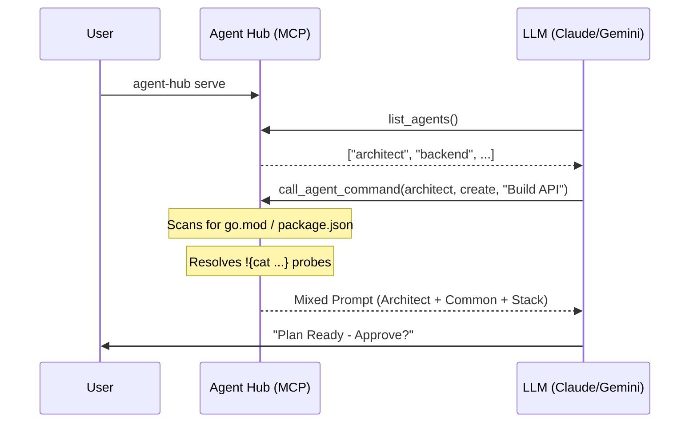

# Technical Specifications: Universal Agent Hub
**Grounding:** Strictly extracted from the `agent-hub` implementation (v1.1.0).
**Verification:** (ref: index.js, bin/agent-hub.js, common/knowledge)

## 1. Entry Points & Access Control
| Type | Endpoint / Tool | Description | Target |
| :--- | :--- | :--- | :--- |
| [CLI] | `agent-hub serve` | Starts the MCP server on stdio. | Claude / Gemini |
| [CLI] | `agent-hub bootstrap` | One-time local environment setup (Gemini/AntiGravity). | Local Machine |
| [CLI] | `agent-hub link <agent> <target>` | Symlinks agent persona to local file (e.g. .cursorrules). | IDEs |
| [MCP] | `list_agents` | Returns a list of all available agent directories. | LLMs |
| [MCP] | `get_agent_prompt` | Retrieves full mixed persona (Persona + Common + Skills). | LLMs |
| [MCP] | `call_agent_command` | Executes TOML-based commands with dynamic mixing. | LLMs |

## 2. Infrastructure: The Agent Hub
- **Runtime:** Node.js (ESM).
- **Core Package:** `@modelcontextprotocol/sdk`.
- **Logic Mixing (The "AMD" Core):**
    - The Hub server dynamically scans `common/knowledge` and `common/skills`.
    - It appends common assets to every agent prompt returned via MCP.
    - **Dynamic Stack Detection:** Scans the current working directory for signature files (e.g., `go.mod`, `package.json`, `pubspec.yaml`) to inject relevant stack knowledge. (ref: `getDynamicKnowledge`)
    - **Probe Resolution:** Automatically resolves `!{cat path}` expressions within command prompts. (ref: `resolveProbes`)

## 3. Data & Persistence Standards
- **Artifact Pipeline:**
    1.  **PRD:** `[FEATURE]_PRD.md` (Owner: Brainstormer).
    2.  **Analysis:** `[FEATURE]_TECHNICAL_ANALYSIS.md` (Owner: Architect).
    3.  **Plan:** `[FEATURE]_IMPLEMENTATION_PLAN.md` (Owner: Architect).
    4.  **Tests:** Business logic coverage (Owner: Developer).
- **Licensing Gate:** `common/knowledge/licensing.md` mandates a "Halt & Ask" for commercial libraries.

## 4. Logic Deep Dive (The Master Pipeline)
1. **Bootstrap:** User runs `npx github:... bootstrap` to install local shortcuts and configure `settings.json`.
2. **Elicitation:** Master calls `brainstormer` to finalize the requirements.
3. **Analysis:** Master calls `architect` to map technical debt and design the fix.
4. **Implementation:** Master detects tech stack and calls the specific developer agent.
5. **Quality:** Each phase requires an explicit "Approved" gate before the Hub allows the next persona to load.

## 5. Technical Flow Visualization

## 6. Complexity Analysis (Dialectical)
- **Yellow Hat (Robustness):** The use of Model Context Protocol (MCP) ensures that the hub can be plugged into any modern LLM environment (Claude, Gemini, Cursor) without rewriting logic.
- **Black Hat (Risks):** Dynamic stack detection relies on file existence; empty projects or complex monorepos might require manual stack hints in `args`. (ref: `index.js`)
- **Blind Spots:** No current support for persistent state across different Hub restarts (session management is handled by the client LLM).
