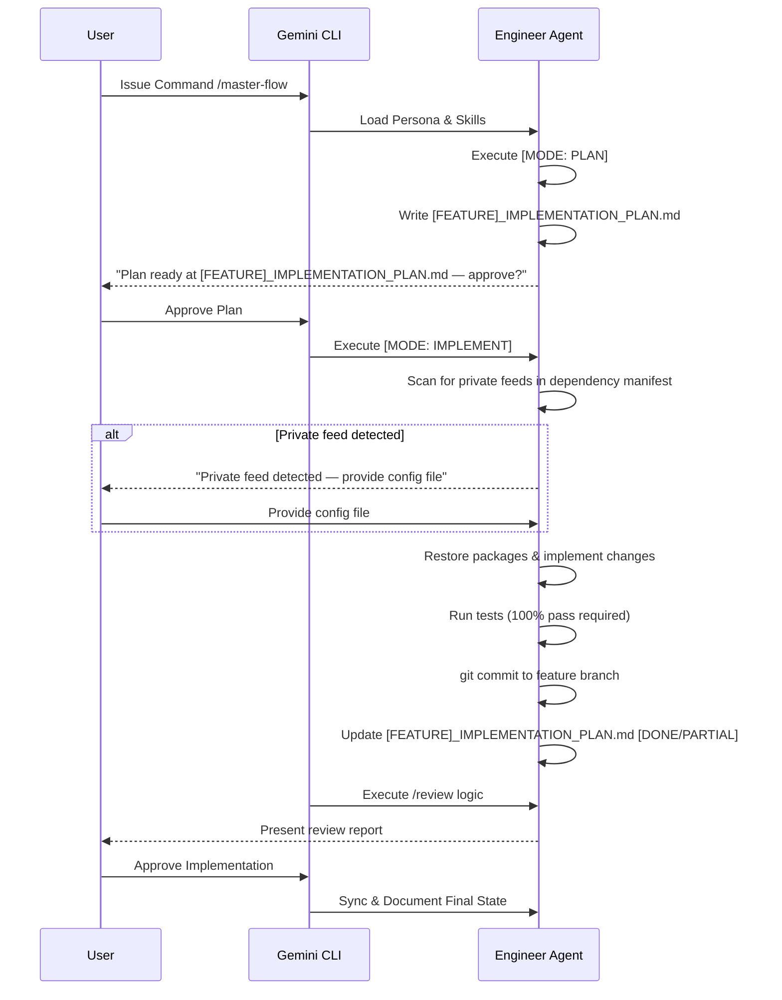

# Technical Specifications: Agentic AI Framework
**Grounding:** Strictly extracted from Agent Definitions (AMD).
**Verification:** (ref: Agent Commands, Protocol Skills)

## 1. Entry Points & Access Control
| Type | Endpoint/Trigger | Description | Allowed Roles | Security/Auth |
| :--- | :--- | :--- | :--- | :--- |
| [TOML] | `/develop` | Software Execution | `Engineer` | Gemini CLI Context |
| [TOML] | `/plan` | Architectural Planning | `Architect` | Gemini CLI Context |
| [TOML] | `/master-flow` | End-to-End Execution | `Systems Architect` | Gemini CLI Context |
| [TOML] | `/investigate` | Deep Dive Investigation | `Systems Architect` | Gemini CLI Context |
| [TOML] | `/audit` | Regulatory Compliance | `Compliance Officer` | Gemini CLI Context |
| [TOML] | `/research` | Research & Synthesis | `Researcher` | Gemini CLI Context |
| [TOML] | `/research-investigate` | Research Deep Dive | `Researcher` | Gemini CLI Context |
| [TOML] | `/security-audit` | Security Vulnerability Audit | `Security Auditor` | Gemini CLI Context |
| [TOML] | `/n8n-workflow` | n8n Workflow Design | `n8n Specialist` | Gemini CLI Context |
| [TOML] | `/n8n-investigate` | n8n Deep Dive Investigation | `n8n Specialist` | Gemini CLI Context |

## 2. Dependency Rules & Lifecycle
- **Internal Dependencies:** Agents use `!{cat ...}` to load persona, skills, and templates. (ref: `engineer/commands/develop.toml`)
- **External Dependencies:** Gemini CLI as the runtime platform for executing shell commands and parsing Markdown/TOML.
- **Inversion of Control:** Each agent encapsulates its own persona and skills (AMD). The Gemini CLI orchestrates the execution flow.

## 3. Data & Persistence Standards
### Database: [N/A - File-Based Configuration]
- **Storage Strategy:** Agent personas, skills, and knowledge are stored as Markdown files. Commands are stored as TOML files.
- **Write Strategy:** Atomic file writes for plan documents and implementation artifacts. (ref: `protocol.md` Step 4: [MODE: PLAN])
- **Plan Naming Convention:** Implementation plans are written as `[FEATURE]_IMPLEMENTATION_PLAN.md`, where `[FEATURE]` is a short UPPER_SNAKE_CASE slug derived from the task (e.g., `AUTH_REFACTOR_IMPLEMENTATION_PLAN.md`). (ref: `protocol.md` Step 4: Naming)

## 4. Resilience & Reliability
### Retry Policies
- **Entry Point Retries:** [MODE: MASTER-FLOW] includes a "Gate 1 (Human Approval)" and "Gate 2 (Human Approval)" (ref: `engineer/skills/protocol.md`).
- **External Call Retries:** N/A (Client-side responsibility).
- **Audit Retries:** On rejection, the flow reverts to Step 3 of the Implementation phase (ref: `protocol.md` Step 5).
- **Private Feed Guard:** If private/internal registries are detected in dependency manifests, execution halts and the user is prompted for the feed config file before the restore proceeds. (ref: `protocol.md` Step 5: Package Restore)

## 5. Logic Deep Dive (Sequential)
### Master-Flow Lifecycle (ref: `engineer/skills/protocol.md`)
1. **Trigger:** User issues `/master-flow` command. (ref: `master-flow.toml`)
2. **Validations:** Pre-Sync checks documentation vs code reality. (ref: `doc_maintainer.md`)
3. **Planning:** Agent writes the plan to `[FEATURE]_IMPLEMENTATION_PLAN.md` and halts for user approval. (ref: `protocol.md` Step 4: [MODE: PLAN])
4. **Package Restore:** Before running tests, agent scans for private feeds. Halts if detected until config file is provided. (ref: `protocol.md` Step 5: [MODE: IMPLEMENT])
5. **Execution:** Implementation of changes, running tests, and committing to a feature branch. (ref: `protocol.md` Steps 4–8: [MODE: IMPLEMENT])
6. **Plan Reconciliation:** After commit, agent updates the plan file with implemented items (+ commit ref) and pending items, stamped `[DONE]` or `[PARTIAL]`. (ref: `protocol.md` Step 9: [MODE: IMPLEMENT])
7. **Review:** Execution of `/review` logic to generate an audit report. (ref: `protocol.md` Step 4: Audit)

### 5.1 Technical Flow Visualization

## 6. Complexity Analysis (Dialectical)
- **Yellow Hat (Robustness):** Human approval gates at every critical junction prevent hallucinated implementations from reaching production. Plan-first persistence ensures the user reviews structured Markdown, not ephemeral chat text. (ref: `protocol.md`)
- **Black Hat (Risks):** Tight coupling between the agents and the Gemini CLI's context-loading (`!{cat ...}`) mechanism means changes in local file structure will break command definitions. (ref: `master-flow.toml`)
- **Blind Spots:** The system lacks an automated rollback mechanism if a commit fails or if documentation sync fails mid-task. Private feed detection relies on static manifest inspection — dynamic registry resolution is not audited.
