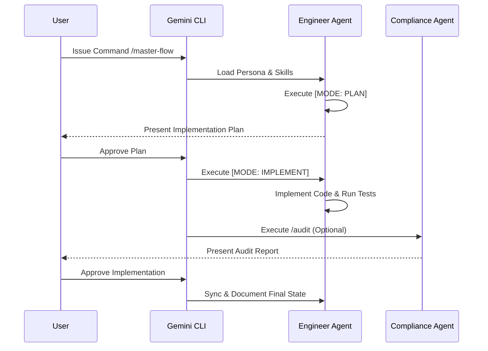

# Technical Specifications: Agentic AI Framework
**Grounding:** Strictly extracted from Agent Definitions (AMD). 
**Verification:** (ref: Agent Commands, Protocol Skills)

## 1. Entry Points & Access Control
| Type | Endpoint/Trigger | Description | Allowed Roles | Security/Auth |
| :--- | :--- | :--- | :--- | :--- |
| [TOML] | `/develop` | Software Execution | `Engineer` | Gemini CLI Context |
| [TOML] | `/plan` | Architectural Planning | `Architect` | Gemini CLI Context |
| [TOML] | `/master-flow` | End-to-End Execution | `Systems Architect` | Gemini CLI Context |
| [TOML] | `/audit` | Regulatory Compliance | `Compliance Officer` | Gemini CLI Context |
| [TOML] | `/research` | Research & Synthesis | `Researcher` | Gemini CLI Context |

## 2. Dependency Rules & Lifecycle
- **Internal Dependencies:** Agents use `!{cat ...}` to load persona, skills, and templates. (ref: `engineer/commands/develop.toml`)
- **External Dependencies:** Gemini CLI as the runtime platform for executing shell commands and parsing Markdown/TOML.
- **Inversion of Control:** Each agent encapsulates its own persona and skills (AMD). The Gemini CLI orchestrates the execution flow.

## 3. Data & Persistence Standards
### Database: [N/A - File-Based Configuration]
- **Storage Strategy:** Agent personas, skills, and knowledge are stored as Markdown files. Commands are stored as TOML files.
- **Write Strategy:** Atomic file writes for implementations and plan documents. (ref: `protocol.md` Step 4: [MODE: PLAN])

## 4. Resilience & Reliability
### Retry Policies
- **Entry Point Retries:** [MODE: MASTER-FLOW] includes a "Gate 1 (Human Approval)" and "Gate 2 (Human Approval)" (ref: `engineer/skills/protocol.md`).
- **External Call Retries:** N/A (Client-side responsibility).
- **Audit Retries:** On rejection, the flow reverts to Step 3 of the Implementation phase (ref: `protocol.md` Step 5).

## 5. Logic Deep Dive (Sequential)
### Master-Flow Lifecycle (ref: `engineer/skills/protocol.md`)
1. **Trigger:** User issues `/master-flow` command. (ref: `master-flow.toml`)
2. **Validations:** Pre-Sync checks documentation vs code reality. (ref: `doc_maintainer.md`)
3. **Planning:** Drafting of the `IMPLEMENTATION_PLAN.md`. (ref: `protocol.md` Step 1: Architectural Intent)
4. **Execution:** Implementation of changes and running tests. (ref: `protocol.md` Step 3: Execution)
5. **Review:** Execution of `/review` logic to generate an audit report. (ref: `protocol.md` Step 4: Audit)

### 5.1 Technical Flow Visualization

## 6. Complexity Analysis (Dialectical)
- **Yellow Hat (Robustness):** The use of human approval gates at every critical junction prevents hallucinated implementations from reaching production. (ref: `protocol.md`)
- **Black Hat (Risks):** Tight coupling between the agents and the Gemini CLI's context-loading (`!{cat ...}`) mechanism means changes in local file structure will break command definitions. (ref: `master-flow.toml`)
- **Blind Spots:** The system lacks an automated rollback mechanism if a commit fails or if documentation sync fails mid-task.
