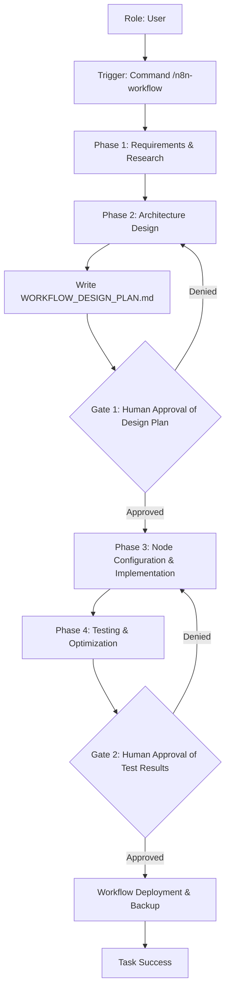

# Use Case: n8n Workflow Automation
**Status:** [ACTIVE] | **Last AST Sync:** 2026-04-11

## 1. Description
An autonomous workflow for designing, implementing, and optimizing complex automation workflows using n8n. It ensures that every automation is architected for scalability, reliability, and maintainability.

## 2. Details
- **Primary Role:** n8n Automation Architect / Workflow Engineer
- **Success Criteria:** Validated design plan, successful manual or automated test runs, comprehensive error handling, and documented workflow logic.

## 3. Visual Logic (Mermaid)

## 4. Key Business Rules
* **Rule 1: Human-in-the-Loop:** No workflow deployment occurs without explicit user approval of the design plan and test results.
* **Rule 2: Modularity:** Workflows must be designed using modular patterns and sub-workflows where appropriate.
* **Rule 3: Error Handling by Default:** Every workflow must include a global error handling strategy and node-level retries for external integrations.
* **Rule 4: Plan-First Persistence:** The design plan is written to `[WORKFLOW]_DESIGN_PLAN.md` before requesting approval. The user reviews the file, not inline text.
* **Rule 5: Security First:** Credentials must never be hardcoded; use n8n's built-in credential management system.
