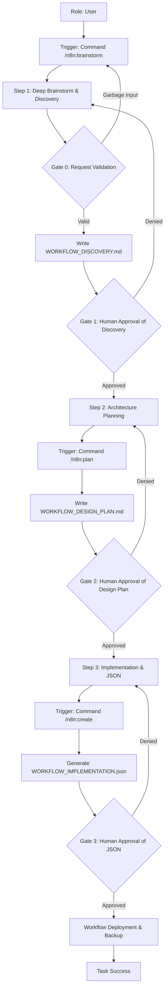

# Use Case: n8n Workflow Automation
**Status:** [ACTIVE] | **Last AST Sync:** 2026-04-11

## 1. Description
An autonomous workflow for designing, implementing, and optimizing complex automation workflows using n8n. It ensures that every automation is architected for scalability, reliability, and maintainability through mandatory deep-brainstorming and research.

## 2. Details
- **Primary Role:** n8n Automation Architect / Workflow Engineer
- **Success Criteria:** Validated discovery artifact (Clarity Score > 8), comprehensive design plan, successful JSON generation, and documented workflow logic.

## 3. Visual Logic (Mermaid)

## 4. Key Business Rules
* **Rule 1: Human-in-the-Loop:** No workflow deployment occurs without explicit user approval of the discovery artifact, the design plan, and the final JSON.
* **Rule 2: No Garbage Inputs:** The agent will reject vague or incomplete requests at the Brainstorming stage. A Clarity Score < 8 halts the process.
* **Rule 3: Discovery-First Persistence:** Findings, API research, and edge-case brainstorming are written to `[WORKFLOW]_DISCOVERY.md` before planning begins.
* **Rule 4: Modularity:** Workflows must be designed using modular patterns and sub-workflows where appropriate.
* **Rule 5: Error Handling by Default:** Every workflow must include a global error handling strategy and node-level retries for external integrations.
* **Rule 6: Plan-First Persistence:** The technical design plan is written to `[WORKFLOW]_DESIGN_PLAN.md` before implementation.
* **Rule 7: Secure Implementation:** Final output is a validated JSON file; credentials must use n8n's built-in management system.
