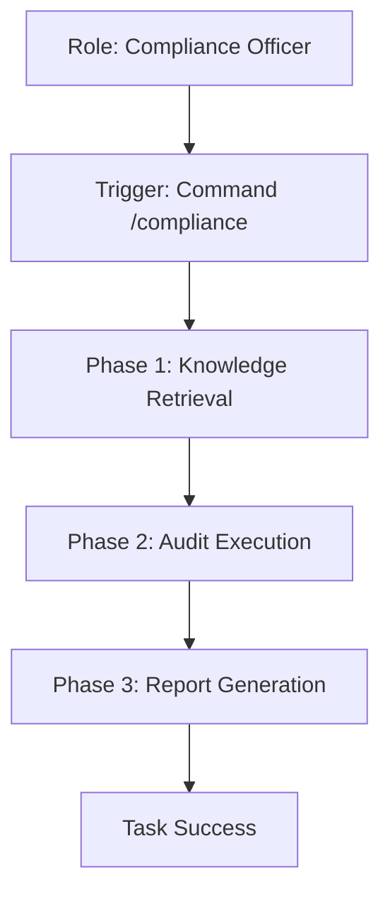

# Use Case: Regulatory & Compliance Audit
**Status:** [ACTIVE] | **Last AST Sync:** 2026-03-03

## 1. Description
A specialized process to audit codebase changes or business processes against specific regulations like GDPR, HIPAA, or SOC2.

## 2. Details
- **Primary Role:** Compliance Officer
- **Success Criteria:** A structured audit report identifying gaps and providing remediation steps.

## 3. Visual Logic (Mermaid)

## 4. Key Business Rules
* **Rule 1: Regulation Specificity:** Every audit must cite specific articles or sections of the relevant regulation.
* **Rule 2: Remediation Mapping:** Any identified gap must include a corresponding technical or process fix.
