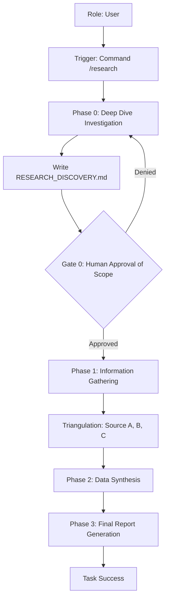

# Use Case: Research & Information Synthesis
**Status:** [ACTIVE] | **Last AST Sync:** 2026-04-11

## 1. Description
A high-fidelity investigative workflow designed to gather, filter, and synthesize data from disparate sources into a cohesive strategic report. This workflow now includes a mandatory discovery phase to ensure research objectives are properly scoped.

## 2. Details
- **Primary Role:** Strategic Researcher
- **Success Criteria:** Triple-triangulated facts, hierarchical data sorting (Primary vs. Tertiary), mandatory discovery artifact, and executive-ready reports.

## 3. Visual Logic (Mermaid)

## 4. Key Business Rules
* **Rule 1: Discovery-First Research:** A research plan and scope must be defined in `[RESEARCH]_DISCOVERY.md` and approved by the user before full data gathering begins.
* **Rule 2: The Rule of Three:** No technical or strategic claim is accepted without cross-referencing three independent sources.
* **Rule 3: Temporal Decay:** Data older than 24 months is deprioritized; data older than 6 months in "Fast Sectors" (AI, Web3) must be explicitly flagged.
* **Rule 4: Clinical Neutrality:** The report must provide verified facts and comparative analysis without speculative strategy or conversational bias.
* **Rule 5: Source Hierarchy:** Primary documentation and official statistics always override secondary news reports or general articles.
