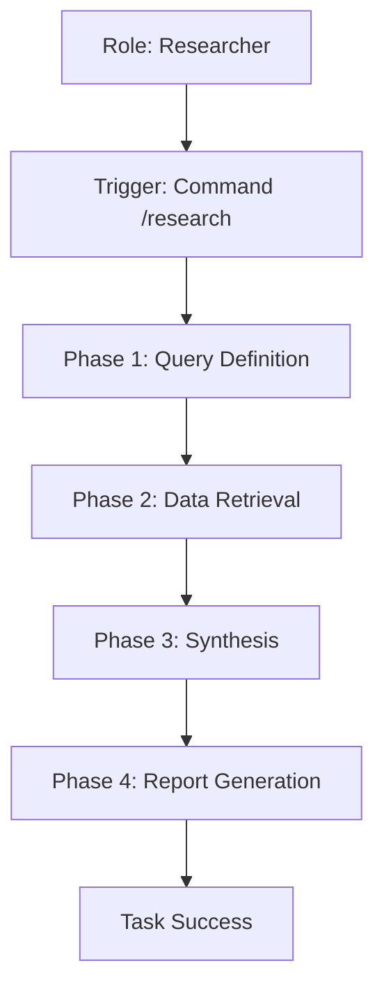

# Use Case: Research & Information Synthesis
**Status:** [ACTIVE] | **Last AST Sync:** 2026-03-03

## 1. Description
Gathering data and technical insights to inform decision-making or generate reports.

## 2. Details
- **Primary Role:** Researcher
- **Success Criteria:** A comprehensive research report with synthesized findings.

## 3. Visual Logic (Mermaid)

## 4. Key Business Rules
* **Rule 1: Grounding:** All claims in the research report must be backed by retrieved data or documentation citations.
* **Rule 2: Synthesis Depth:** Reports must provide actionable insights rather than just raw data.
