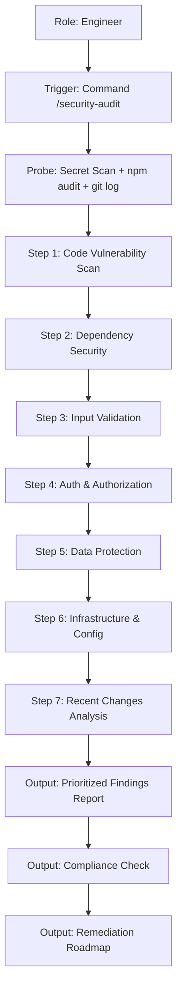

# Use Case: Security Audit
**Status:** [ACTIVE] | **Last AST Sync:** 2026-03-17

## 1. Description
An autonomous workflow that performs a comprehensive security audit of a target codebase or set of changes — scanning for OWASP Top 10 vulnerabilities, hardcoded secrets, vulnerable dependencies, misconfigured infrastructure, and authentication flaws — and delivers a prioritized remediation roadmap.

## 2. Details
- **Primary Role:** Security Auditor / Engineer
- **Success Criteria:** All findings catalogued by severity, each with a confirmed location, impact assessment, and actionable remediation steps. Compliance alignment reported against OWASP ASVS, NIST SP 800-53, and applicable data protection regulations.

## 3. Visual Logic (Mermaid)

## 4. Key Business Rules
* **Rule 1: Confirmed Findings Only:** Do not speculate. Every finding must cite a file path and line number.
* **Rule 2: Severity-First Delivery:** Report output is always ordered Critical → High → Medium → Low.
* **Rule 3: No Remediation Without Evidence:** Each fix instruction must reference the specific vulnerability it addresses.
* **Rule 4: Compliance Mapping:** All findings must be cross-referenced against applicable standards (OWASP ASVS, NIST, GDPR/LGPD/HIPAA where relevant).
