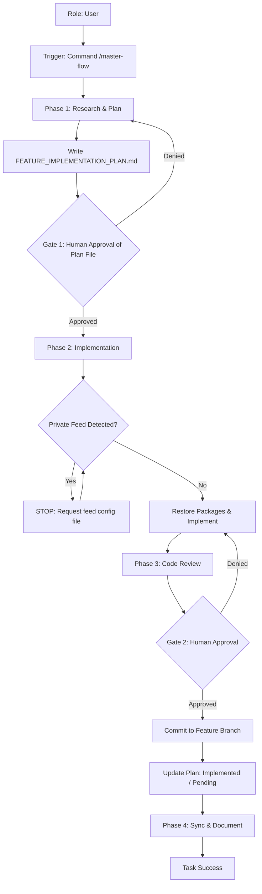

# Use Case: Software Engineering Lifecycle
**Status:** [ACTIVE] | **Last AST Sync:** 2026-03-18

## 1. Description
An autonomous workflow that moves from a business requirement to a validated, documented implementation through research, planning, execution, and review.

## 2. Details
- **Primary Role:** Software Engineer / Systems Architect
- **Success Criteria:** 100% test pass rate, updated documentation, peer-reviewed plan written to file before approval, and plan reconciliation log after commit.

## 3. Visual Logic (Mermaid)

## 4. Key Business Rules
* **Rule 1: Human-in-the-Loop:** No implementation or commit occurs without explicit user approval of the plan or the final review.
* **Rule 2: Zero Trust:** Unverified code is never merged. All changes must be backed by unit or integration tests.
* **Rule 3: Conceptual Integrity:** All code changes must be reflected in the documentation immediately after implementation.
* **Rule 4: Plan-First Persistence:** The plan is written to `[FEATURE]_IMPLEMENTATION_PLAN.md` before requesting approval. The user reviews the file, not inline text.
* **Rule 5: Private Feed Safety:** If private/internal package registries are detected, execution halts until the user provides the feed configuration file.
* **Rule 6: Plan Reconciliation:** After every commit, the plan file is updated with what was implemented (with commit ref) and what remains pending, stamped `[DONE]` or `[PARTIAL]`.
