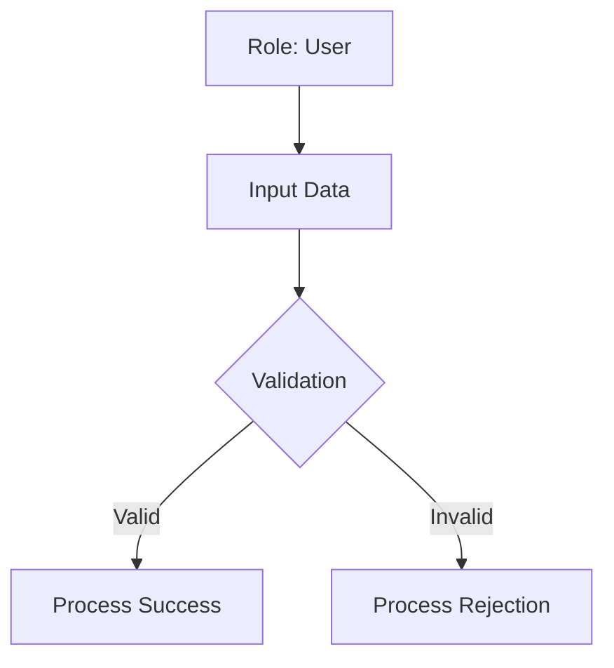

# Business Flow: [Project Name]
**Status:** [STATE] | **Last AST Sync:** [Date]

## 1. Value Proposition
[One sentence: The core purpose of the codebase.]

## 2. Business Use Cases

### 2.1 [Use Case Name, e.g., User Creation]
- **Description:** [A fluid, non-technical description of the journey from trigger to resolution.]
- **Primary Role:** [e.g., Administrator, Anonymous User, Customer]
- **Success Criteria:** [What defines the completion of this business process?]

### 2.2 Visual Logic (Mermaid)

## 3. Key Business Rules
* **Rule 1**: [Business logic, e.g., "Only Managers can approve refunds over $500"]